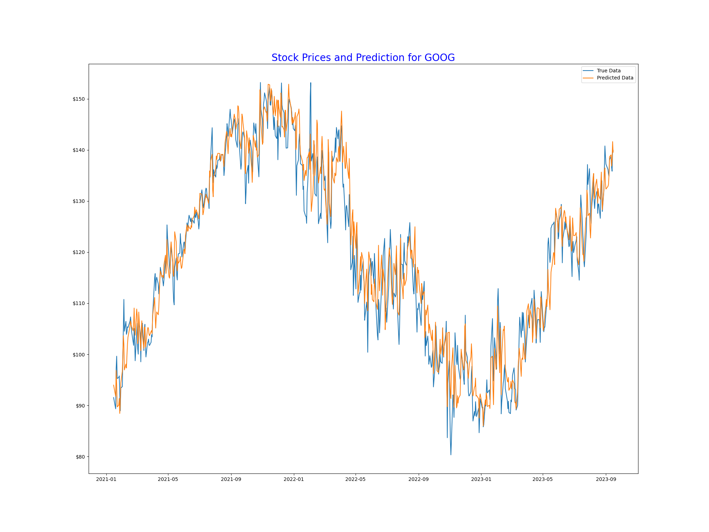

# Auto Trading with RNN and LSTM

## Overview

The Auto Trading project is designed to make predictions on stock prices using the power of Recurrent Neural Networks (RNN) and Long Short-Term Memory (LSTM) networks. The goal of the system is to provide insights and forecasts on future stock prices, allowing for potentially better trading decisions.

## Features

- **Time Series Forecasting**: Use the historical data of stocks to forecast future prices.
  
- **Deep Learning Models**: Utilizes RNN and LSTM which are well-suited for time series and sequential data.
  
- **Data Visualization**: Offers graphical representations of predicted vs actual stock prices for better understanding.

## Prerequisites

- Python 3.8+
- Keras (with TensorFlow backend)
- NumPy, Pandas
- Yfinance
- Matplotlib(for visualization)

## Installation

1. Clone the repository:
   ``` bash
   git clone https://github.com/your-username/AutoTrading.git
   ```
2. Navigate to the `AutoTrading` directory:
    ```bash
    cd AutoTrading
    ```
3. Install the required packages:
    ```bash
    pip install -r requirements.txt
    ```

## Usage

1. Generate a stock dataset based on your input company code (code found on Yahoo Finance)
2. To train the model on your dataset
3. Visual predict result in the result.png
4. Prediction of future price in the terminal
5. Result Example:
 


## Data Format

Ensure your data is in the following format:


- `Date`: The date of the data (format: YYYY-MM-DD).
- `Open`: The stock opening price of the day.
- `High`: The highest stock price of the day.
- `Low`: The lowest stock price of the day.
- `Close`: The stock closing price of the day.
- `Volume`: Number of shares traded.

Note: The model mainly uses the `Close` price for predictions, but other features can be integrated with modifications.

## Contributing

Feel free to submit issues or pull requests, contributions are welcome!

## License

This project is licensed under the MIT License.

